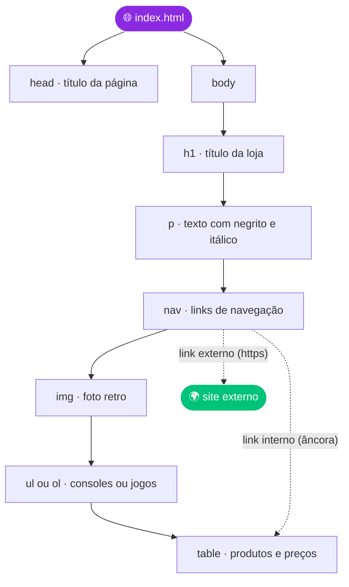

<a id="readme-top"></a>

<!--
  ✏️ PERSONALIZE ANTES DE PUBLICAR
  1. Troque SEU-USUARIO pelo seu usuário do GitHub (Ctrl+F / Ctrl+H).
  2. Salve um print da página como preview.png na raiz do repositório.
  3. Confira os nomes dos arquivos na seção "Estrutura do Repositório".
  4. Revise os checklists e desmarque o que não se aplicar.
-->

<div align="center">


<a href="https://github.com/DenverCoder1/readme-typing-svg">
  
</a>

<br/>


<br/>

<br/>

**[Visão Geral](#-visão-geral)** &nbsp;•&nbsp;
**[Requisitos](#-requisitos-essenciais)** &nbsp;•&nbsp;
**[Anatomia](#-anatomia-da-página)** &nbsp;•&nbsp;
**[Critérios](#-critérios-de-avaliação)** &nbsp;•&nbsp;
**[Como Executar](#-como-executar)** &nbsp;•&nbsp;
**[Autor](#-autor)**

</div>

---

## 📑 Índice

1. [Visão Geral](#-visão-geral)
2. [Objetivo e Missão](#-objetivo-e-missão)
3. [Requisitos Essenciais](#-requisitos-essenciais)
4. [Especificações Técnicas](#-especificações-técnicas)
5. [Anatomia da Página](#-anatomia-da-página)
6. [Guia Rápido de Tags](#-guia-rápido-de-tags)
7. [Preview](#-preview)
8. [Critérios de Avaliação](#-critérios-de-avaliação)
9. [Controle de Qualidade](#-controle-de-qualidade)
10. [Como Executar](#-como-executar)
11. [Estrutura do Repositório](#-estrutura-do-repositório)
12. [Aprendizados](#-aprendizados)
13. [Próximos Passos](#-próximos-passos)
14. [Referências](#-referências)
15. [Autor](#-autor)

---

## 📋 Visão Geral

> [!NOTE]
> Este repositório contém a entrega da **Atividade da Aula 5 — HTML Parte 1**, avaliada em **100 pontos**.

A **GameZone Retro** é uma loja fictícia especializada em **jogos clássicos**. O desafio consiste em criar a sua **página promocional**: compacta, funcional e feita apenas com **HTML puro**, demonstrando os principais conceitos da linguagem em **no máximo 50 linhas de código**.

<div align="center">

| 🎮 Tema | 📏 Limite | 🧩 Elementos | 💯 Valor |
|:---:|:---:|:---:|:---:|
| **Loja de games retro** | **50 linhas** | **5 essenciais** | **100 pontos** |

</div>

```text
╔══════════════════════════════════════════════════╗
║  G A M E Z O N E   R E T R O                     ║
║  ──────────────────────────────────────────────  ║
║  ALUNO : VINYCIUS                                ║
║  FASE      : HTML PARTE 1  (AULA 5)              ║
║  MISSÃO    : PÁGINA EM NO MÁXIMO 50 LINHAS       ║
║  VALOR     : 100 PONTOS                          ║
║  ──────────────────────────────────────────────  ║
║  REQUISITOS  [████████████████████]  5 / 5       ║
║                                                  ║
║            >>  PRESS  START  <<                  ║
╚══════════════════════════════════════════════════╝
```

<p align="right"><a href="#readme-top">⬆ voltar ao topo</a></p>

---

## 🎯 Objetivo e Missão

> *"Você foi contratado para criar uma página promocional da **GameZone Retro**, uma loja especializada em jogos clássicos. A página deve ser compacta, funcional e demonstrar os principais conceitos de HTML."*
>
> — Enunciado do desafio

**Missões desta fase:**

| Missão | Descrição |
|:--|:--|
| 📏 **Concisão** | Criar uma página HTML de **no máximo 50 linhas** |
| 🧩 **Completude** | Incluir os **5 elementos essenciais** do desafio |
| 🧹 **Organização** | Manter o código limpo, indentado e legível |
| 🔗 **Funcionalidade** | Garantir que os links (interno e externo) funcionem |
| 🏅 **Bônus** | Entregar tudo em **menos de 50 linhas** e virar *mestre da concisão* |

<p align="right"><a href="#readme-top">⬆ voltar ao topo</a></p>

---

## ✅ Requisitos Essenciais

A página apresenta os **5 elementos essenciais** exigidos pelo desafio:

| # | Elemento | O que foi pedido | Tags HTML | Status |
|:-:|:--|:--|:--|:-:|
| 1 | 📝 **Estrutura básica** | Título e parágrafos com texto em **negrito** e *itálico* | `<h1>` `<p>` `<strong>` `<em>` | ✅ |
| 2 | 📋 **Lista** | Uma lista ordenada **ou** não ordenada (consoles **ou** jogos) | `<ul>` ou `<ol>` + `<li>` | ✅ |
| 3 | 🧭 **Navegação** | Pelo menos **um link interno** (âncora) e **um externo** | `<a href="#id">` e `<a href="https://...">` | ✅ |
| 4 | 🖼 **Imagem** | Uma foto relacionada ao tema | `` | ✅ |
| 5 | 💰 **Tabela** | Lista simples de produtos e preços (**mínimo de 3 itens**) | `<table>` `<tr>` `<th>` `<td>` | ✅ |

> [!TIP]
> **Dicas do desafio**
> - Escolha apenas **uma** lista (não precisa de ambas).
> - Use **emojis** para dar personalidade à página.
> - Mantenha o conteúdo **simples, mas funcional**.
> - **Teste o link de navegação interna** antes de entregar.
> - A tabela pode ser bem básica: **3 linhas bastam**.

<p align="right"><a href="#readme-top">⬆ voltar ao topo</a></p>

---

## 🔧 Especificações Técnicas

| Especificação | Detalhe |
|:--|:--|
| 📏 **Tamanho máximo** | 50 linhas de código HTML |
| 🧱 **Tecnologia** | HTML puro e simples |
| 🧩 **Conteúdo** | Os 5 elementos essenciais listados acima |
| 🎮 **Tema** | Loja de games retro |
| 🎯 **Prioridade** | Funcionalidade sobre aparência |

<p align="right"><a href="#readme-top">⬆ voltar ao topo</a></p>

---

## 🧱 Anatomia da Página

Ordem lógica dos elementos e como a navegação se conecta:



### 🔗 Como funciona a âncora (link interno)

O link e o destino se conectam pelo **mesmo nome**: o `href` começa com `#` e o `id` do destino **não** leva o `#`.

```html
<!-- Origem: o link que o visitante clica -->
<a href="#produtos">Ver produtos</a>

<!-- Destino: o id deve ser igual ao que vem depois do # -->
<h2 id="produtos">Tabela de Produtos</h2>
```

<p align="right"><a href="#readme-top">⬆ voltar ao topo</a></p>

---

## 📖 Guia Rápido de Tags

Referência das tags que fazem parte do desafio:

| Tag | Para que serve | Exemplo |
|:--|:--|:--|
| `<h1>` | Título principal da página | `<h1>GameZone Retro</h1>` |
| `<p>` | Parágrafo de texto | `<p>Jogos clássicos!</p>` |
| `<strong>` | **Negrito** (texto importante) | `<strong>Jogos clássicos</strong>` |
| `<em>` | *Itálico* (ênfase) | `<em>diversão garantida</em>` |
| `<ul>` `<li>` | Lista **não ordenada** | `<ul><li>Atari 2600</li></ul>` |
| `<ol>` `<li>` | Lista **ordenada** | `<ol><li>Mega Drive</li></ol>` |
| `<a href="#id">` | Link **interno** (âncora) | `<a href="#produtos">Produtos</a>` |
| `id="..."` | Marca o **destino** da âncora | `<h2 id="produtos">Produtos</h2>` |
| `<a href="https://...">` | Link **externo** | `<a href="https://exemplo.com">Site</a>` |
| `` | Imagem (com texto alternativo) | `` |
| `<table>` | Estrutura da tabela | `<table>...</table>` |
| `<tr>` `<th>` `<td>` | Linha, cabeçalho e célula | `<tr><th>Jogo</th><th>Preço</th></tr>` |

<p align="right"><a href="#readme-top">⬆ voltar ao topo</a></p>

---

## 📸 Preview

<div align="center">


<sub>Captura de tela da página no navegador.</sub>

</div>

<p align="right"><a href="#readme-top">⬆ voltar ao topo</a></p>

---

## 🏆 Critérios de Avaliação

Placar final de **100 pontos**. Veja como cada critério foi atendido:

| Critério | Como foi atendido | Status |
|:--|:--|:-:|
| 📏 **Limite de 50 linhas** | Contagem de linhas conferida no arquivo final | ✅ |
| 🧩 **5 elementos essenciais** | Título, negrito e itálico, lista, links, imagem e tabela presentes | ✅ |
| 🧹 **Código limpo e organizado** | Indentação consistente e tags bem fechadas | ✅ |
| 🔗 **Funcionalidade dos links** | Link interno (âncora) e link externo testados no navegador | ✅ |
| 📐 **Estrutura HTML válida** | Documento conferido no validador do W3C | ✅ |

- [x] Respeitar o limite de 50 linhas
- [x] Implementar os 5 elementos essenciais
- [x] Código limpo e organizado
- [x] Funcionalidade dos links
- [x] Estrutura HTML válida

> 🏅 **Bônus:** implementar tudo em menos de 50 linhas garante o título de **mestre da concisão**.

<p align="right"><a href="#readme-top">⬆ voltar ao topo</a></p>

---

## 🧪 Controle de Qualidade

### Antes de entregar

- [x] Contei as linhas do arquivo (máximo de 50)
- [x] Validei o HTML no [W3C Markup Validation Service](https://validator.w3.org/)
- [x] Cliquei no **link interno** e a página rolou até o destino
- [x] Cliquei no **link externo** e ele abriu corretamente
- [x] A **imagem** carrega e possui texto alternativo (`alt`)
- [x] A **tabela** tem cabeçalho e pelo menos **3 itens**

**Como contar as linhas do arquivo:**

```bash
# Linux, macOS ou Git Bash
wc -l index.html
```

```powershell
# Windows PowerShell
(Get-Content index.html).Count
```

### Boas práticas de HTML

| Prática | Por quê |
|:--|:--|
| `<!DOCTYPE html>` na primeira linha | Indica ao navegador que o documento é HTML5 |
| `<html lang="pt-BR">` | Informa o idioma para navegadores e leitores de tela |
| `<meta charset="UTF-8">` | Garante que acentos e emojis apareçam corretamente |
| `<title>` descritivo | Aparece na aba do navegador e nos resultados de busca |
| `alt` em toda imagem | Acessibilidade e fallback caso a imagem não carregue |
| `id` único e sem espaços | Necessário para a âncora funcionar |
| Indentação consistente | Facilita a leitura e a manutenção do código |
| Tags sempre fechadas | Evita erros de estrutura e de renderização |

<p align="right"><a href="#readme-top">⬆ voltar ao topo</a></p>

---

## 🚀 Como Executar

Não precisa instalar nada. É só HTML! 🙌

**Pré-requisitos:** apenas um navegador (Chrome, Edge, Firefox...). Git e VS Code são opcionais.

**1. Clone o repositório**

```bash
git clone https://github.com/SEU-USUARIO/assignment.git
```

**2. Entre na pasta**

```bash
cd assignment
```

**3. Abra a página no navegador**

Dê um duplo clique em `index.html` ou abra pelo terminal:

```bash
# Windows
start index.html

# macOS
open index.html

# Linux
xdg-open index.html
```

<details>
<summary><b>⚡ Alternativa: Live Server no VS Code</b></summary>

<br/>

1. Instale a extensão **Live Server** no VS Code
2. Clique com o botão direito em `index.html`
3. Escolha **Open with Live Server**
4. A página abre no navegador e **atualiza sozinha** a cada alteração salva

</details>

<details>
<summary><b>🌍 Publicar online com o GitHub Pages</b></summary>

<br/>

1. No repositório, vá em **Settings → Pages**
2. Em **Source**, escolha a branch `main` e a pasta `/ (root)`
3. Clique em **Save** e aguarde alguns instantes
4. Sua página ficará disponível em:

```text
https://SEU-USUARIO.github.io/assignment/
```

</details>

<p align="right"><a href="#readme-top">⬆ voltar ao topo</a></p>

---

## 📁 Estrutura do Repositório

```text
assignment/
├── 📄 index.html    # Página da GameZone Retro (máx. 50 linhas)
├── 🖼 retro.jpg     # Imagem usada na página
├── 📸 preview.png   # Captura de tela exibida neste README
└── 📘 README.md     # Documentação do projeto
```

<p align="right"><a href="#readme-top">⬆ voltar ao topo</a></p>

---

## 🧠 Aprendizados

| Conceito | O que eu aprendi |
|:--|:--|
| 🏗 **Estrutura do documento** | Montar o esqueleto com `<!DOCTYPE>`, `<html>`, `<head>` e `<body>` |
| ✍️ **Ênfase em texto** | Usar `<strong>` e `<em>` para dar significado ao texto |
| 📋 **Listas** | Diferença entre listas ordenadas (`<ol>`) e não ordenadas (`<ul>`) |
| 🔗 **Links** | Criar links internos (âncoras com `id`) e links externos |
| 🖼 **Imagens** | Inserir imagens com `src` e `alt` para acessibilidade |
| 📊 **Tabelas** | Organizar dados em linhas, cabeçalhos e células |
| ✂️ **Código enxuto** | Escrever HTML limpo e objetivo dentro de um limite de linhas |

<p align="right"><a href="#readme-top">⬆ voltar ao topo</a></p>

---

## 🔭 Próximos Passos

Ideias para evoluir a GameZone Retro nas próximas fases:

- [ ] 🎨 Estilizar a página com **CSS** (cores, fontes e layout retro)
- [ ] 📱 Deixar a página **responsiva** para celulares
- [ ] 🛒 Ampliar o catálogo com mais consoles, jogos e preços
- [ ] 📬 Adicionar um **formulário de contato**
- [ ] 🌍 Publicar no **GitHub Pages**

<p align="right"><a href="#readme-top">⬆ voltar ao topo</a></p>

---

## 📚 Referências

| Recurso | Link |
|:--|:--|
| 📘 Documentação de HTML (MDN, pt-BR) | [developer.mozilla.org/pt-BR/docs/Web/HTML](https://developer.mozilla.org/pt-BR/docs/Web/HTML) |
| ✅ Validador de HTML (W3C) | [validator.w3.org](https://validator.w3.org/) |
| 📜 Especificação oficial do HTML | [html.spec.whatwg.org](https://html.spec.whatwg.org/) |
| 🌍 Documentação do GitHub Pages | [docs.github.com/pt/pages](https://docs.github.com/pt/pages) |

**Créditos visuais deste README:** [Shields.io](https://shields.io/) (badges), [Capsule Render](https://github.com/kyechan99/capsule-render) (banner) e [Readme Typing SVG](https://github.com/DenverCoder1/readme-typing-svg) (texto animado).

---

## 👾 Autor

<div align="center">

### 🕹️ Ficha do Jogador

| | |
|:--|:--|
| 👤 **Aluno* | Vinycius |
| 🏫 **Turma** | 1I-IDS |
| 👨‍🏫 **Professor** | Raul Porto Lopes |
| 📚 **Missão** | Atividade Aula 5 — HTML Parte 1 |
| 💯 **Pontuação máxima** | 100 pontos |
| 🐙 **GitHub** | [@SEU-USUARIO](https://github.com/vinyciussilva-cloud) |

</div>

> [!IMPORTANT]
> Projeto **acadêmico**, desenvolvido para fins de aprendizado.

<div align="center">

<br/>

**Boa sorte, desenvolvedor! Que a força dos pixels esteja com você!** 🕹️

<br/>

<a href="#readme-top">⬆ voltar ao topo</a>


</div>
