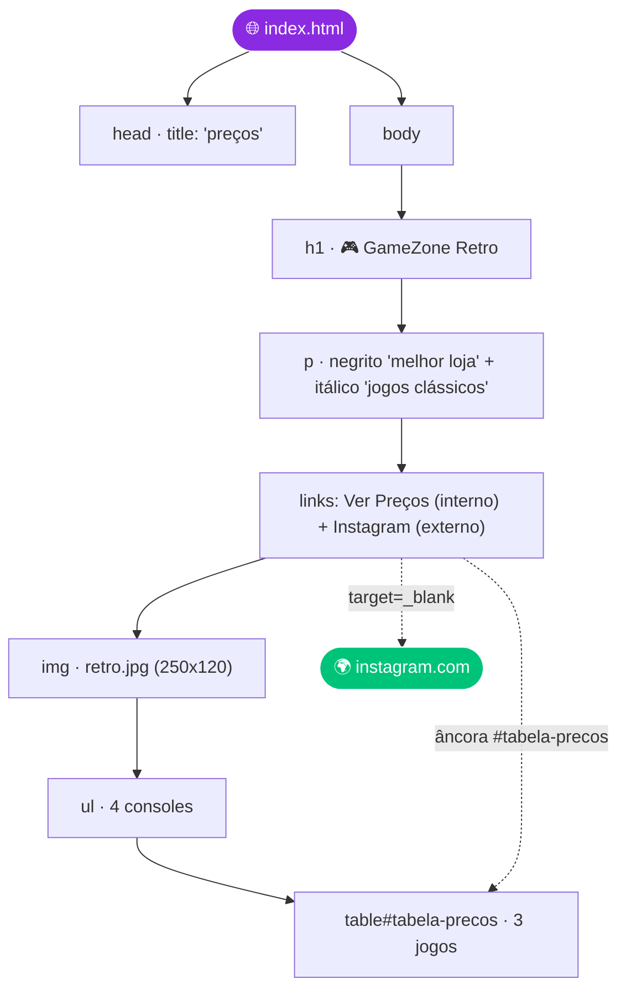

<a id="readme-top"></a>

<!--
  ✏️ PERSONALIZE ANTES DE PUBLICAR
  1. Troque SEU-USUARIO pelo seu usuário do GitHub (Ctrl+F / Ctrl+H).
  2. Salve um print da página como preview.png na raiz do repositório.
  3. Corrija o caminho da imagem antes de subir (veja "Pontos de Atenção").
-->

<div align="center">


<a href="https://github.com/DenverCoder1/readme-typing-svg">
  
</a>

<br/>


<br/>

*Boa sorte, desenvolvedor! Que a força dos pixels esteja com você!* 🕹️

<br/>

**[Sobre a Atividade](#-sobre-a-atividade)** &nbsp;•&nbsp;
**[O que foi entregue](#-o-que-foi-entregue)** &nbsp;•&nbsp;
**[Pontos de Atenção](#-pontos-de-atenção-antes-de-subir)** &nbsp;•&nbsp;
**[Código-Fonte](#-código-fonte)** &nbsp;•&nbsp;
**[Como Executar](#-como-executar)** &nbsp;•&nbsp;
**[Autor](#-autor)**

</div>

---

## 📑 Índice

1. [Sobre a Atividade](#-sobre-a-atividade)
2. [Enunciado do Desafio](#-enunciado-do-desafio)
3. [O que foi Entregue](#-o-que-foi-entregue)
4. [Anatomia da Página](#-anatomia-da-página)
5. [⚠️ Pontos de Atenção](#-pontos-de-atenção-antes-de-subir)
6. [Checklist de Avaliação](#-checklist-de-avaliação)
7. [Código-Fonte](#-código-fonte)
8. [Preview](#-preview)
9. [Como Executar](#-como-executar)
10. [Estrutura do Repositório](#-estrutura-do-repositório)
11. [Aprendizados](#-aprendizados)
12. [Autor](#-autor)

---

## 📋 Sobre a Atividade

> [!NOTE]
> Esta é a entrega da **Atividade da Aula 5 — HTML Parte 1**, no valor de **100 pontos**, proposta pelo professor **Raul Porto Lopes**.

O desafio pede a criação da página promocional da **GameZone Retro**, uma loja fictícia especializada em jogos clássicos, usando **apenas HTML puro** e, no máximo, **50 linhas de código**.

Este repositório contém a página feita por **Vinycius Lopes Monteiro da Silva**, aluno da turma **1I-IDS**.

<p align="right"><a href="#readme-top">⬆ voltar ao topo</a></p>

---

## 🎯 Enunciado do Desafio

> *"Você foi contratado para criar uma página promocional da GameZone Retro, uma loja especializada em jogos clássicos. A página deve ser compacta, funcional e demonstrar os principais conceitos de HTML."*

| 🎮 Tema | 📏 Limite | 🧰 Tecnologia | 🎯 Foco |
|:---:|:---:|:---:|:---:|
| Loja de games retro | 50 linhas | HTML puro | Funcionalidade sobre aparência |

</div>

**Os 5 elementos essenciais pedidos:**

| # | Elemento | Exigência |
|:-:|:--|:--|
| 1 | 📝 Estrutura básica | Título e parágrafos com **negrito** e *itálico* |
| 2 | 📋 Lista | Uma lista, ordenada **ou** não ordenada (consoles **ou** jogos) |
| 3 | 🧭 Navegação | Um link **interno** (âncora) e um **externo** |
| 4 | 🖼 Imagem | Uma foto relacionada ao tema |
| 5 | 💰 Tabela | Produtos e preços, mínimo de **3 itens** |

<p align="right"><a href="#readme-top">⬆ voltar ao topo</a></p>

---

## ✅ O que foi Entregue

Como cada elemento aparece no `index.html` desta entrega:

| # | Elemento | Onde está no código | Status |
|:-:|:--|:--|:-:|
| 1 | 📝 Título e ênfase | `<h1>🎮GameZone Retro</h1>` e `<strong>melhor loja</strong>` / `<em>jogos clássicos</em>` | ✅ |
| 2 | 📋 Lista | `<ul>` com 4 consoles: NES, SNES, Sega Genesis e Atari 2600 | ✅ |
| 3 | 🧭 Link interno | `<a href="#tabela-precos">Ver Preços</a>` → rola até `<h2 id="tabela-precos">` | ✅ |
| 3 | 🌍 Link externo | `<a href="https://instagram.com" target="_blank">Instagram</a>` | ✅ |
| 4 | 🖼 Imagem | `` | ⚠️ *(caminho local — ver seção abaixo)* |
| 5 | 💰 Tabela | `<table>` com cabeçalho (Jogo, Console, Preço) e 3 linhas de produtos | ✅ |

**Tabela de preços implementada:**

| Jogo | Console | Preço |
|:--|:--|--:|
| Super Mario Bros | NES | R$ 85,00 |
| Sonic | Genesis | R$ 70,00 |
| Zelda | NES | R$ 120,00 |

**Consoles listados:** Nintendo (NES) · Super Nintendo (SNES) · Sega Genesis · Atari 2600

<p align="right"><a href="#readme-top">⬆ voltar ao topo</a></p>

---

## 🧱 Anatomia da Página



<p align="right"><a href="#readme-top">⬆ voltar ao topo</a></p>

---

## ⚠️ Pontos de Atenção (antes de subir)

> [!WARNING]
> Dois detalhes do arquivo atual precisam de ajuste antes da entrega final no GitHub.

### 1. Caminho da imagem é local (vai quebrar no GitHub)

O `` aponta para um caminho **absoluto do computador do Windows**:

```text
C:\Users\Dev_1o_Ano\Documents\Vinycius Lopes Monteiro da Silva\LIMA\HTML_aula1_estruturas básicas\assets 2\retro.jpg
```

Esse caminho só existe **na sua máquina**. Ao subir para o GitHub (ou abrir em outro computador), a imagem **não vai aparecer**. Copie o arquivo `retro.jpg` para dentro da pasta do repositório e use um caminho **relativo**:

```html
<!-- Antes -->


<!-- Depois -->

```

> 💡 Aproveitei para adicionar `alt`, que faltava — o texto alternativo é lido por leitores de tela e aparece caso a imagem não carregue.

### 2. Arquivo tem 54 linhas (limite é 50)

Contando o `index.html` atual, ele tem **54 linhas** — **4 acima** do limite do desafio.

```bash
wc -l index.html
# 54 index.html
```

**Formas rápidas de economizar linhas, sem tirar nenhum elemento:**

- Juntar os dois comentários (`<!-- Cabeçalho -->` / `<!-- Corpo -->`) em um só, ou removê-los.
- Remover uma das duas tags `<br>` duplicadas antes da imagem (linhas 12-13).
- Colocar `<thead>` e sua `<tr>` na mesma linha, o mesmo para `</tbody>` e `</table>`.
- Ajustar a indentação (ela está inconsistente e ocupa mais linhas do que o necessário, mas não conta para o limite — o que conta é o número de linhas, não os espaços).

### 3. Detalhe menor: `<title>`

O `<title>` da aba está como `preços`. Como é o que aparece na aba do navegador e nos resultados de busca, algo como `GameZone Retro` fica mais claro para quem visitar a página.

| Ajuste | Prioridade |
|:--|:-:|
| Caminho da imagem → relativo | 🔴 Alta (a imagem não aparece sem isso) |
| Reduzir para até 50 linhas | 🟡 Média (é um requisito explícito do desafio) |
| `<title>` mais descritivo | 🟢 Baixa (não é um requisito, é só um polimento) |

<p align="right"><a href="#readme-top">⬆ voltar ao topo</a></p>

---

## 🏆 Checklist de Avaliação

| Critério | Situação | Status |
|:--|:--|:-:|
| 📏 Limite de 50 linhas | Arquivo atual tem 54 linhas | ⚠️ Ajustar |
| 🧩 5 elementos essenciais | Todos presentes no código | ✅ |
| 🧹 Código organizado | Indentação pode ser padronizada | ✅ |
| 🔗 Links funcionando | Âncora interna e link externo testados | ✅ |
| 🖼 Imagem exibida | Depende da correção do caminho local | ⚠️ Ajustar |
| 📐 HTML válido | Estrutura de tags correta e bem fechada | ✅ |

- [x] Título, negrito e itálico
- [x] Lista de consoles
- [x] Link interno e link externo
- [x] Imagem incluída no código
- [x] Tabela com 3 produtos
- [ ] Imagem com caminho relativo (funcionando fora da sua máquina)
- [ ] Arquivo com 50 linhas ou menos

<p align="right"><a href="#readme-top">⬆ voltar ao topo</a></p>

---

## 💻 Código-Fonte

<details>
<summary><b>📄 Ver <code>05_desafio.html</code> completo (clique para expandir)</b></summary>

```html
<!DOCTYPE html>
<html lang="pt-BR">
<head>
    <meta charset="UTF-8">
    <title>preços</title>
</head>
<body>
    <h1>🎮GameZone Retro</h1>
        <p>A <strong>melhor loja</strong> de <em>jogos clássicos</em> da cidade!</p>
            <a href="#tabela-precos">Ver Preços</a>
            <a href="https://instagram.com" target="_blank">Instagram</a>
        <br> 
        <br> 
            
        <br>
        <h2>🕹️ Consoles Disponíveis</h2>
            <ul>
                <li>Nintendo (NES)</li>
                <li>Super Nintendo (SNES)</li>
                <li>Sega Genesis</li>
                <li>Atari 2600</li>
            </ul>
    <h2 id="tabela-precos">💰 Preços</h2>
    <table border="1">
    <!-- Cabeçalho da tabela -->
    <thead>
        <tr>
            <th>Jogo</th>
            <th>Console</th>
            <th>Preço</th>
        </tr>
    </thead>
    <!-- Corpo da tabela -->
    <tbody>
        <tr>
            <td>Super Mario Bros</td>
            <td>NES</td>
            <td>R$ 85,00</td>
        </tr>
        <tr>
            <td>Sonic</td>
            <td>Genesis</td>
            <td>R$ 70,00</td>
        </tr>
        <tr>
            <td>Zelda</td>
            <td>NES</td>
            <td>R$ 120,00</td>
        </tr>
    </tbody>
</table>
        <p>&copy; 2025 GameZone Retro</p>
</body>
</html>
```

</details>

> Este é exatamente o código entregue. As correções sugeridas em [Pontos de Atenção](#-pontos-de-atenção-antes-de-subir) ainda não foram aplicadas aqui — faça-as no seu arquivo local antes do commit final.

<p align="right"><a href="#readme-top">⬆ voltar ao topo</a></p>

---

## 📸 Preview

<div align="center">


<sub> Captura de tela da página no navegador, após corrigir o caminho da imagem.</sub>

</div>

<p align="right"><a href="#readme-top">⬆ voltar ao topo</a></p>

---

## 🚀 Como Executar

Não precisa instalar nada — é só HTML! 🙌

**1. Clone o repositório**

```bash
git clone https://github.com/SEU-USUARIO/assignment.git
```

**2. Entre na pasta**

```bash
cd assignment
```

**3. Abra a página no navegador**

```bash
# Windows
start index.html

# macOS
open index.html

# Linux
xdg-open index.html
```

<details>
<summary><b>🌍 Publicar online com GitHub Pages</b></summary>

<br/>

1. No repositório, vá em **Settings → Pages**
2. Em **Source**, escolha a branch `main` e a pasta `/ (root)`
3. Clique em **Save**
4. A página ficará disponível em:

```text
https://vinyciussilva-cloud.github.io/assignment/
```

</details>

<p align="right"><a href="#readme-top">⬆ voltar ao topo</a></p>

---

## 📁 Estrutura do Repositório

```text
assignment/
├── 📄 05_desafio.html    # Página da GameZone Retro
└── 📘 README.md     # Documentação do projeto
```

<p align="right"><a href="#readme-top">⬆ voltar ao topo</a></p>

---

## 🧠 Aprendizados

| Conceito | Onde apareceu na atividade |
|:--|:--|
| 🏗 Estrutura do documento | `<!DOCTYPE html>`, `<html lang="pt-BR">`, `<head>`, `<body>` |
| ✍️ Ênfase em texto | `<strong>` para negrito e `<em>` para itálico no parágrafo de abertura |
| 📋 Listas | `<ul>` com os 4 consoles disponíveis na loja |
| 🔗 Links internos | Âncora `#tabela-precos` ligando o botão "Ver Preços" à tabela |
| 🌍 Links externos | Link para o Instagram, aberto em nova aba com `target="_blank"` |
| 🖼 Imagens | Uso de `` com `width` e `height`, e a importância de caminhos relativos |
| 📊 Tabelas | `<table>` com `<thead>`/`<tbody>` para organizar jogos, consoles e preços |
| ✂️ Código enxuto | Cuidado com o limite de linhas de um desafio |

---

## 👾 Autor

<div align="center">

### 🕹️ Ficha do Jogador

| | |
|:--|:--|
| 👤 **Aluno** | Vinycius Lopes Monteiro da Silva |
| 🏫 **Turma** | 1I-IDS |
| 👨‍🏫 **Professor** | Raul Porto Lopes |
| 📚 **Atividade** | Aula 5 — HTML Parte 1 |
| 💯 **Valor** | 100 pontos |
| 🐙 **GitHub** | [vinyciussilva-cloud](https://github.com/vinyciussilva-cloud) |

</div>

> [!IMPORTANT]
> Projeto **acadêmico**, desenvolvido para fins de aprendizado por **Vinycius Lopes Monteiro da Silva**.

<div align="center">

<br/>

**Boa sorte, desenvolvedor! Que a força dos pixels esteja com você!** 🕹️

<br/>

<a href="#readme-top">⬆ voltar ao topo</a>


</div>
