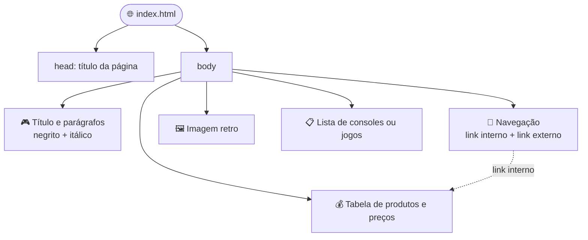

<div align="center">


<a href="https://git.io/typing-svg">
  
</a>

<br/>


<br/>

**[Sobre](#-sobre-o-desafio)** &nbsp;•&nbsp;
**[Requisitos](#-requisitos-essenciais)** &nbsp;•&nbsp;
**[Anatomia](#-anatomia-da-página)** &nbsp;•&nbsp;
**[Placar](#-critérios-de-avaliação)** &nbsp;•&nbsp;
**[Executar](#-como-executar)** &nbsp;•&nbsp;
**[Autor](#-autor)**

</div>

<br/>

---

## 📋 Sobre o Desafio

> *"Você foi contratado para criar uma página promocional da **GameZone Retro**, uma loja especializada em jogos clássicos."*

Este repositório reúne a entrega da **Atividade da Aula 5 — HTML Parte 1**: uma página promocional **compacta, funcional e feita só com HTML puro**, que apresenta a loja de forma organizada e demonstra os conceitos fundamentais da linguagem.

Tudo isso em **no máximo 50 linhas de código**. Cada linha conta! 🕹️

<div align="center">

| 🎮 Tema | 📏 Limite | 🧰 Tecnologia | 🎯 Foco |
|:---:|:---:|:---:|:---:|
| Loja de games retro | 50 linhas | HTML puro | Funcionalidade sobre aparência |

</div>

---

## 🎯 Objetivo

Criar uma página HTML de **no máximo 50 linhas** que apresente a **GameZone Retro** de forma clara, organizada e com todos os elementos essenciais funcionando.

---

## ✅ Requisitos Essenciais

A página implementa os **5 elementos essenciais** pedidos no desafio:

| # | Elemento | O que foi pedido | Tags HTML |
|:-:|:---------|:-----------------|:----------|
| 1 | 📝 **Estrutura básica** | Título e parágrafos com texto em **negrito** e *itálico* | `<h1>` `<p>` `<strong>` `<em>` |
| 2 | 📋 **Lista** | Uma lista ordenada **ou** não ordenada (consoles ou jogos) | `<ul>` / `<ol>` `<li>` |
| 3 | 🧭 **Navegação** | Pelo menos um link **interno** (âncora) e um **externo** | `<a href="#id">` `<a href="https://...">` |
| 4 | 🖼️ **Imagem** | Uma foto relacionada ao tema | `` |
| 5 | 💰 **Tabela** | Lista simples de produtos e preços (mínimo de 3 itens) | `<table>` `<tr>` `<th>` `<td>` |

---

## 🧱 Anatomia da Página

Um mapa rápido de como a página está organizada:



---

## 🖼️ Preview

<div align="center">


</div>

---

## 🏆 Critérios de Avaliação

Placar final de **100 pontos**. Checklist do que foi entregue:

- [x] **Respeitar o limite de 50 linhas**
- [x] **Implementar os 5 elementos essenciais**
- [x] **Código limpo e organizado**
- [x] **Funcionalidade dos links** (interno e externo testados)
- [x] **Estrutura HTML válida**

> 🏅 **Bônus:** implementar tudo em menos de 50 linhas garante o título de *mestre da concisão*.

---

## 🚀 Como Executar

Não precisa instalar nada. É só HTML! 🙌

**1. Clone o repositório**

```bash
git clone https://github.com/SEU-USUARIO/assignment.git
```

**2. Entre na pasta**

```bash
cd assignment
```

**3. Abra a página no navegador**

Dê um duplo clique no arquivo `index.html` ou, se preferir, abra pelo terminal:

```bash
# Windows
start index.html

# macOS
open index.html

# Linux
xdg-open index.html
```

<details>
<summary><b>🌍 Quer publicar online? Use o GitHub Pages (clique para expandir)</b></summary>

<br/>

1. No repositório, vá em **Settings → Pages**
2. Em **Source**, escolha a branch `main` e a pasta `/ (root)`
3. Clique em **Save** e aguarde alguns instantes
4. Sua página ficará disponível em:

```
https://SEU-USUARIO.github.io/assignment/
```

</details>

---

## 📁 Estrutura do Repositório

```text
assignment/
├── 📄 index.html      # A página da GameZone Retro (max. 50 linhas)
├── 🖼️ retro.jpg       # Imagem usada na página
├── 📸 preview.png     # Print da página para este README
└── 📘 README.md       # Você está aqui
```

---

## 🧠 O que eu aprendi

- 🏗️ Montar a **estrutura básica** de um documento HTML (`<!DOCTYPE>`, `<html>`, `<head>`, `<body>`)
- ✍️ Dar **ênfase** ao texto com `<strong>` e `<em>`
- 📋 Organizar informações com **listas** ordenadas e não ordenadas
- 🔗 Criar **links internos (âncoras)** e **externos**
- 🖼️ Inserir **imagens** com texto alternativo (`alt`) para acessibilidade
- 📊 Estruturar dados em **tabelas**
- ✂️ Escrever **código enxuto**, limpo e dentro de um limite de linhas

---

## 👾 Autor

<div align="center">

### 🕹️ Ficha do Jogador

| | |
|:--|:--|
| 👤 **Jogador 1** | Vinycius |
| 🏫 **Turma** | 1I-IDS |
| 👨‍🏫 **Professor** | Raul Porto Lopes |
| 📚 **Missão** | Atividade Aula 5 — HTML Parte 1 |
| 💯 **Pontuação máxima** | 100 pontos |
| 🐙 **GitHub** | [@SEU-USUARIO](https://github.com/SEU-USUARIO) |

<br/>

**Boa sorte, desenvolvedor! Que a força dos pixels esteja com você!** 🕹️

<br/>

`GAME OVER?` &nbsp;→&nbsp; **NÃO!** &nbsp;`CONTINUE? 9... 8... 7...` 🪙

<br/>


</div>
